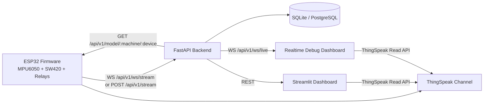
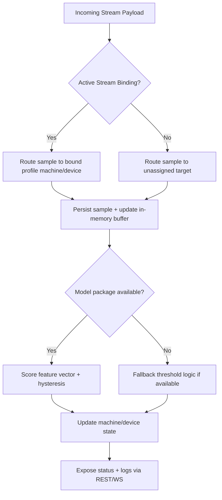
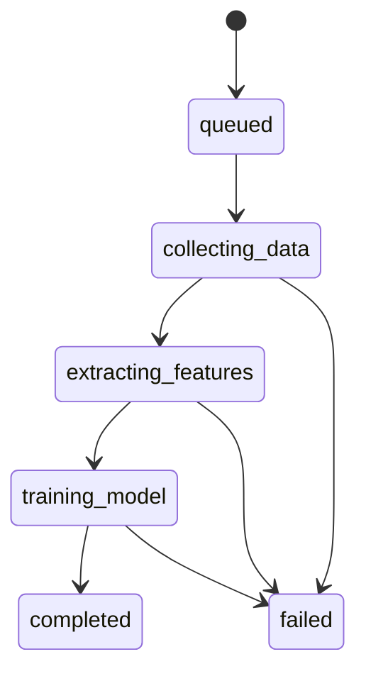

# MachinoCare

[](https://railway.app/new/template?template=https://github.com/tester248/MachinoCare)
[](https://www.python.org/)
[](https://fastapi.tiangolo.com/)
[](https://streamlit.io/)
[](https://www.postgresql.org/)

MachinoCare is an end-to-end predictive maintenance platform for vibration monitoring.

It combines:
- ESP32 firmware (MPU6050 + SW420 + relays + buttons)
- FastAPI backend (stream ingest, calibration, model serving, debug telemetry)
- Streamlit operator dashboard
- FastAPI-hosted realtime debug dashboard (`/debug-dashboard`)

## Table of Contents

- [What This Repo Contains](#what-this-repo-contains)
- [Core Concepts](#core-concepts)
- [Architecture Diagrams](#architecture-diagrams)
- [Feature Summary](#feature-summary)
- [Quick Start (Local)](#quick-start-local)
- [Configuration](#configuration)
- [API Reference](#api-reference)
- [Dashboard Guide](#dashboard-guide)
- [Firmware Integration](#firmware-integration)
- [Blynk Config Automation](#blynk-config-automation)
- [Deployment (Railway)](#deployment-railway)
- [Development and Validation](#development-and-validation)
- [Troubleshooting](#troubleshooting)
- [Safety Note](#safety-note)

## What This Repo Contains

- `backend/` FastAPI service, calibration pipeline, persistence, debug logs, websocket feed
- `dashboard/` Streamlit control room
- `firmware/MachinoCare_ESP32/` ESP32 firmware
- `docs/` supplementary setup docs (including Blynk)
- `scripts/railway_setup_postgres.sh` Railway DB/bootstrap automation
- `run_all.py` launcher for backend + Streamlit side-by-side
- `Procfile` process entrypoint (`web: python run_all.py`)
- `railway.toml` Railway build/start/healthcheck config

## Core Concepts

### 1) Profile-first operation

Profiles represent target machines/devices with calibration defaults. Both dashboards are profile-centric:
- Select profile by display name
- Create/update/delete profiles
- Associate incoming stream to selected profile

### 2) Stream binding controls ingest routing

`POST /api/v1/stream` and `WS /api/v1/ws/stream` accept ESP payloads for compatibility, but backend routing is determined by active stream binding:
- If binding is active: samples route to bound profile machine/device
- If no binding: samples route to unassigned target
    - `MACHINOCARE_UNASSIGNED_MACHINE_ID` (default: `unassigned_machine`)
    - `MACHINOCARE_UNASSIGNED_DEVICE_ID` (default: `unassigned_device`)

### 3) Hybrid realtime visibility

- Streamlit dashboard: operator-centric controls + live metrics + live API logs + ThingSpeak history
- FastAPI debug dashboard: no-flicker websocket feed + payload inspector + ThingSpeak history

### 4) Storage mode

Auto-detected backend:
- PostgreSQL if `DATABASE_URL` is set
- Otherwise SQLite (`MACHINOCARE_DB`, default `data/machinocare.db`)

## Architecture Diagrams

### End-to-end system flow



### Stream ingest routing and anomaly status



### Calibration job lifecycle



## Feature Summary

### Backend

- Real-time stream ingest (`sample` and batch `samples`)
- WebSocket stream ingest with ACK/error responses (`WS /api/v1/ws/stream`)
- Synchronous and asynchronous calibration
- Device-specific model packaging and retrieval
- Status and anomaly logging
- API request/response debug log capture with retention policy
- WebSocket live snapshots (status + latest sample + new debug logs)
- Profile CRUD and stream-binding APIs

### Streamlit dashboard

- Profile-first workflow (display-name dropdown)
- Create/update/delete profiles
- Stream association controls
- Live chart field toggles with human-readable names
- ThingSpeak field toggles with channel-defined field names
- Live API log table + payload inspector
- Pulsing live indicator for refresh heartbeat

### FastAPI debug dashboard (`/debug-dashboard`)

- WebSocket-first live charting and status
- Realtime API logs table + payload viewer
- Profile management and stream association controls
- ThingSpeak history with selectable fields

### Firmware (ESP32)

- Motor/fan relays and physical button controls
- SW420 emergency behavior path
- Blynk telemetry/control integration
- ThingSpeak publishing
- Batched backend streaming over WebSocket with HTTP fallback
- Backend stream and model pull support

## Quick Start (Local)

### 1. Create and activate environment

```bash
python -m venv .venv
source .venv/bin/activate
```

### 2. Install dependencies

```bash
pip install -r requirements.txt
```

### 3. Run services

Option A (separate):

```bash
uvicorn backend.main:app --reload --host 0.0.0.0 --port 8000
```

```bash
streamlit run dashboard/app.py --server.port 8501
```

Option B (together):

```bash
python run_all.py
```

### 4. Open interfaces

- FastAPI docs: `http://localhost:8000/docs`
- FastAPI health: `http://localhost:8000/api/v1/health`
- FastAPI debug dashboard: `http://localhost:8000/debug-dashboard`
- Streamlit dashboard: `http://localhost:8501`

## Configuration

### Backend environment variables

| Variable | Default | Purpose |
|---|---|---|
| `MACHINOCARE_DB` | `data/machinocare.db` | SQLite file path when not using PostgreSQL |
| `DATABASE_URL` | unset | Enables PostgreSQL mode |
| `MACHINOCARE_BUFFER_SIZE` | `12000` | In-memory sample buffer size |
| `MACHINOCARE_DEBUG_SAMPLE_RATE` | `0.10` | Debug payload sampling ratio |
| `MACHINOCARE_DEBUG_RETENTION_DAYS` | `30` | Debug log retention window |
| `MACHINOCARE_DEBUG_MAX_BODY_BYTES` | `20000` | Max captured request/response body bytes |
| `MACHINOCARE_LIVE_PUSH_INTERVAL_SECONDS` | `0.75` | WebSocket live snapshot cadence |
| `MACHINOCARE_UNASSIGNED_MACHINE_ID` | `unassigned_machine` | Fallback routing machine ID when unbound |
| `MACHINOCARE_UNASSIGNED_DEVICE_ID` | `unassigned_device` | Fallback routing device ID when unbound |

### Launcher variables (`run_all.py`)

| Variable | Default | Purpose |
|---|---|---|
| `PORT` / `BACKEND_PORT` | `8000` | FastAPI port (`PORT` preferred for Railway) |
| `DASHBOARD_PORT` | `8501` | Streamlit port |
| `BACKEND_HOST` | `0.0.0.0` | FastAPI bind host |
| `DASHBOARD_HOST` | `0.0.0.0` | Streamlit bind host |
| `ENABLE_RELOAD` | `0` | Adds `--reload` to uvicorn when `1` |

### Streamlit variables

| Variable | Default | Purpose |
|---|---|---|
| `MACHINOCARE_API_URL` | `http://localhost:8000` | Backend base URL for dashboard calls |
| `MACHINOCARE_THINGSPEAK_CHANNEL` | `3336916` | Default ThingSpeak channel in UI |

## API Reference

Base prefix: `/api/v1`

### Platform

- `GET /health`
- `GET /` redirects to `/docs`

### Streaming and status

- `POST /stream`
- `WS /ws/stream`
- `GET /stream/{machine_id}/recent`
- `GET /status/{machine_id}`
- `GET /status/{machine_id}/{device_id}`
- `GET /anomaly-log/{machine_id}`

### Calibration and model

- `POST /calibrate`
- `POST /calibrate/start`
- `POST /calibrate/start/profile/{machine_id}/{device_id}`
- `GET /calibrate/status/{job_id}`
- `GET /model/{machine_id}`
- `GET /model/{machine_id}/{device_id}`

### Discovery and profile routing

- `GET /machines`
- `GET /devices/{machine_id}`
- `GET /device-profiles`
- `POST /device-profiles`
- `GET /device-profiles/{machine_id}/{device_id}`
- `DELETE /device-profiles/{machine_id}/{device_id}`
- `GET /stream-binding`
- `POST /stream-binding`
- `DELETE /stream-binding`

### Debug

- `GET /debug/logs`
- `WS /ws/live`

## Dashboard Guide

### Streamlit dashboard (`dashboard/app.py`)

Use Streamlit for day-to-day operator workflow:
- Pick profile by display name
- Create/update/delete profiles
- Associate or clear incoming stream target
- Start calibration with profile defaults or manual overrides
- Toggle live chart fields
- Toggle ThingSpeak fields by label
- Review live API logs and payload snippets

### FastAPI debug dashboard (`/debug-dashboard`)

Use debug dashboard for deeper runtime diagnostics:
- WebSocket status and sample stream
- Live API logs with payload inspector
- Profile controls and stream binding
- ThingSpeak history and field toggles

## Firmware Integration

Firmware source:
- `firmware/MachinoCare_ESP32/MachinoCare_ESP32.ino`

Before flashing, replace placeholders:
- `BLYNK_AUTH_TOKEN`
- `ssid`
- `password`
- `TS_WRITE_KEY`
- `BACKEND_BASE_URL`

Firmware no longer depends on hardcoded `MACHINE_ID`/`DEVICE_ID` constants for stream upload.
Incoming routing is profile-driven using backend stream binding.

Streaming transport (current firmware):
- Primary: WebSocket ingest (`/api/v1/ws/stream`)
- Fallback: HTTP ingest (`POST /api/v1/stream`)
- Batch size: 5 samples per send attempt
- In-memory queue capacity: 30 samples
- ACK timeout fallback to HTTP batch resend

Calibration defaults in firmware now use `sample_rate_hz = 1` to match the 1 Hz stream timer.

Pin mapping (current):
- `SW420_PIN = 34`
- `RELAY_MOTOR_PIN = 25`
- `RELAY_FAN_PIN = 26`
- `LED_PIN = 27`
- `BUZZER_PIN = 33`

Blynk relay/output control mapping (current):
- `V14` -> motor relay
- `V15` -> fan relay
- `V20` -> buzzer
- `V21` -> LED manual override

Blynk alert mode and threshold mapping (current):
- `V22` -> SW420 threshold seconds
- `V23` -> SW420 frame seconds
- `V24` -> MPU accel magnitude deviation threshold
- `V25` -> MPU gyro magnitude deviation threshold
- `V27` -> debug mode toggle
- `V28` -> alert mode selector (`0=SW420 basic`, `1=MPU deviation`, `2=backend ML`)

Blynk alert telemetry mapping (recommended for demo):
- `V26` -> mode-aware status text
- `V29` -> active alert mode (numeric mirror of V28)
- `V30` -> primary mode metric
    - Mode 0: SW420 accumulated HIGH seconds in current frame
    - Mode 1: MPU accel deviation from baseline
    - Mode 2: backend score (`-1` when unavailable)
- `V31` -> secondary mode metric
    - Mode 0: SW420 threshold seconds
    - Mode 1: MPU gyro deviation from baseline
    - Mode 2: backend decision threshold (`-1` when unavailable)

Blynk setup details:
- `docs/BLYNK_FINAL_DEMO_SETUP.md`

## Blynk Config Automation

Yes, you can automate part of Blynk configuration import/generation.

What you can automate reliably:
- Template/device provisioning via Blynk HTTP API
- Datastream creation and updates from a JSON/CSV spec
- Device creation from a prepared template

What is usually not fully one-click importable:
- Complete visual dashboard/widget layout placement in a single portable config file

Recommended workflow:
1. Build one master template manually (widgets + datastream design).
2. Keep datastream definitions in repo as machine-readable config.
3. Use a small script to sync datastream definitions to Blynk via API.
4. Clone/reuse the template for new devices/environments.

This gives repeatability without recreating everything by hand each time.

## Deployment (Railway)

### Included deployment files

- `railway.toml`
    - start command: `python run_all.py`
    - healthcheck: `/api/v1/health`
- `Procfile`
    - `web: python run_all.py`

### Recommended production pattern

1. Connect repository to Railway
2. Add PostgreSQL service
3. Wire `DATABASE_URL` to backend service
4. Deploy and verify:
     - `/api/v1/health`
     - `/docs`
     - `/debug-dashboard`

### Railway CLI bootstrap helper

```bash
railway login
RAILWAY_PROJECT_ID=<project-id> \
RAILWAY_BACKEND_SERVICE=<backend-service-name> \
./scripts/railway_setup_postgres.sh
railway up
```

Optional helper vars:
- `RAILWAY_ENVIRONMENT`
- `RAILWAY_POSTGRES_SERVICE` (default `machinocare-postgres`)
- `RAILWAY_SKIP_CREATE_DB=1`

## Development and Validation

### Install deps

```bash
pip install -r requirements.txt
```

### Compile sanity checks

```bash
python -m compileall backend dashboard
```

### Typical files to inspect while developing

- `backend/main.py`
- `backend/storage.py`
- `backend/ml_engine.py`
- `backend/debug_dashboard.py`
- `dashboard/app.py`

## Troubleshooting

### Stream posts are accepted but profile chart is empty

- Check active stream association in dashboard
- Confirm `POST /api/v1/stream-binding` points to selected profile

### Data disappears after redeploy

- If using SQLite without persistent volume, data is ephemeral
- Set `DATABASE_URL` to Railway PostgreSQL (recommended)

### Debug logs are too noisy

- Reduce `MACHINOCARE_DEBUG_SAMPLE_RATE`
- Tune `MACHINOCARE_DEBUG_RETENTION_DAYS`

### Dashboard cannot reach backend

- Verify `MACHINOCARE_API_URL`
- Verify health endpoint and CORS/network path

## Safety Note

Start firmware with `debugMode = true` during bench testing.
Switch to `debugMode = false` only when you are ready to enable hard emergency behavior.